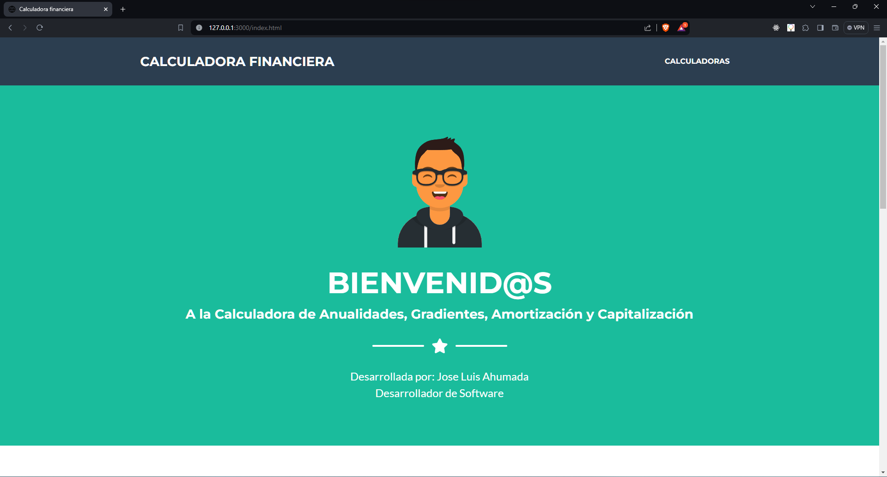

# calculadora-financiera
Desarrollo de una Aplicación Web para Calcular Anualidades, Gradientes, Amortización y Capitalización desarrollada en Html, Css, JavaScript

 

# Capturas de los resultados Obtenidos

# Sección Calculadoras

## Items
- Anualidad vencida y Anticipada (Valor Presente; Futuro; Anualidad con Valor Presente, con Valor Futuro; Pagos/ Cuotas con Valor Presente, con valor Futuro)
- Gradiente Lineal Creciente y Decreciente (Valor Presente; Futuro; Anualidad con Valor Presente, con Valor Futuro; Pagos/ Cuotas con Valor Presente, con valor Futuro)
  
 

 

- Amortización y Capitalización
 

